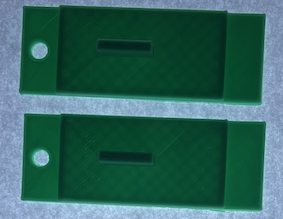
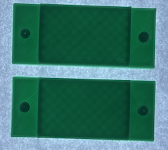
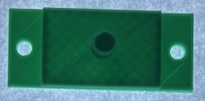
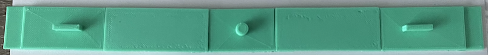

# Pegboard

## Description
Create an animators pegboard to hold paper steady. To build print the following files.

### pegboard outers

### pegboard Joiners

### pegboard Center

### Finished layout.

### Specs

* Created in: [Blender](https://www.blender.org)
* 3D Printer used: [Toybox](https://www.make.toys/)

### Toybox Direct Links

* [pegboard outers](https://www.make.toys/custom-toy-view/?toyId=wuhGikWZAS5KFjkPe)
* [pegboard Joiners](https://www.make.toys/custom-toy-view/?toyId=BKtmBHgReyQYruHqQ)
* [pegboard Center](https://www.make.toys/custom-toy-view/?toyId=kNspLNB4XgewXsTCs)
